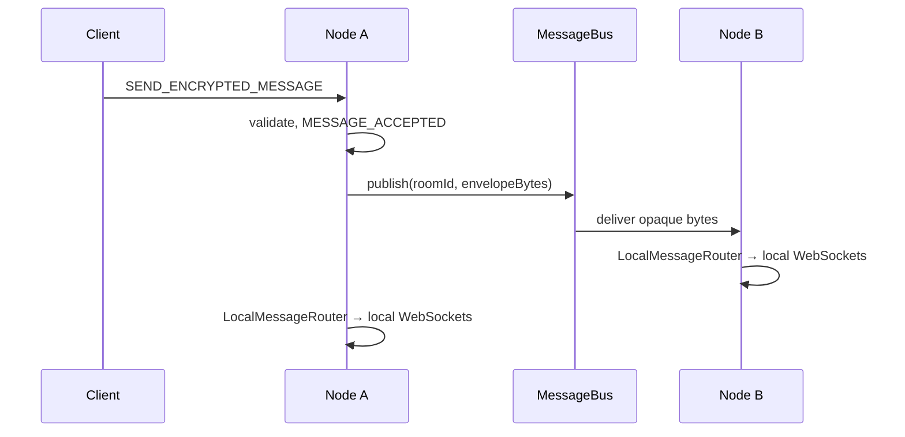

# Ghost Bunker Protocol Server — Scaling Plan

This document describes how the reference server is structured for **future multi-node
deployment** without introducing external infrastructure in the current release.

## Goals

- Horizontally scale WebSocket fan-out when room participants span multiple JVMs.
- Preserve **Privacy-Max**: no persistence of ciphertext, plaintext payloads, IP addresses, or
  durable user identity.
- Keep the **wire protocol and `.proto` unchanged**; clients need no changes for clustering.

## Current release (v0.4.0-alpha)

The server remains **single-node**. Spring wires default in-memory / local implementations:

| Interface | Default implementation | Role |
|-----------|------------------------|------|
| `SessionRegistry` | `InMemorySessionRegistry` | Live connections on this JVM |
| `RoomRegistry` | `InMemoryRoomRegistry` | Room membership on this JVM |
| `PresenceRegistry` | `InMemoryPresenceRegistry` | Ephemeral `online_count` (derived from local rooms) |
| `MessageRouter` | `LocalMessageRouter` | Local WebSocket recipients for a room |
| `MessageBus` | `NoopMessageBus` | Cross-node publish (no-op today) |
| `RateLimitStore` | `InMemoryRateLimitStore` | Per-connection sliding windows in `GhostSession` |
| `BackpressurePolicy` | `DefaultBackpressurePolicy` | Outbound queue byte/message caps |

`GhostBunkerWebSocketHandler` depends on these abstractions only. Behavior matches prior
releases: accept → route locally → drop (no message store).

## Target multi-node flow (future)



1. Sender connects to any node (sticky session via load balancer).
2. Node validates and emits `MESSAGE_ACCEPTED` as today.
3. Node **publishes opaque encoded envelopes** to `MessageBus` (not a message database).
4. Each subscriber node uses `LocalMessageRouter` + `SessionRegistry` to push to local peers.
5. `MESSAGE_RECEIVED_ACK` stays fire-and-forget with **no server-side persistence**.

## Future implementation options (not in scope yet)

These are **design placeholders only**. This repository does not add Redis, Kafka, or a
database in v0.4.0-alpha.

### SessionRegistry

- **Problem**: Know which node owns a connection for control messages (GOODBYE, admin drain).
- **Approach**: Short-TTL entry in a distributed cache (session id → node id). Values must not
  include IP or nickname. Entries expire when the socket closes.

### RoomRegistry

- **Problem**: Local membership is insufficient for routing keys.
- **Approach**: Keep authoritative membership **on the connection’s home node**; use the bus for
  fan-out, not a global room graph. Avoid storing participant lists in shared storage.

### PresenceRegistry

- **Problem**: `ROOM_JOINED.online_count` may need cluster-wide totals.
- **Approach**: Approximate counters (HyperLogLog-style or short-TTL increments) with explicit
  “approximate” semantics in docs, or keep per-node counts if the product accepts it.

### MessageBus

- **Problem**: Cross-node ciphertext fan-out.
- **Approach**: Pub/sub (e.g. NATS, Redis pub/sub, Kafka topic per room shard) carrying **only**
  serialized `GhostEnvelope` bytes already on the wire. Consumers must not write to disk.
- **Retention**: Zero or seconds — not a chat log.

### RateLimitStore

- **Problem**: Per-connection limits are local today.
- **Approach**: Optional shared token bucket keyed by opaque connection id for abuse mitigation;
  still no user identity or payload storage.

### BackpressurePolicy

- Remains **per-connection on each node** (`GhostSession` outbound counters). No change required
  for clustering beyond local send paths.

## Sticky sessions and load balancing

- WebSocket upgrades require **session affinity** (cookie or IP hash) so a client stays on one JVM
  for its lifetime.
- Health checks should use actuator readiness; draining sends `SERVER_SHUTDOWN` GOODBYE via
  `GracefulShutdownService` + `SessionRegistry.snapshot()`.

## Explicit non-goals

- No account/login system.
- No server-side decryption or plaintext handling.
- No historical message store, search, or replay.
- No logging of ciphertext, payloads, or client IP in application code.

## Swapping implementations

Replace `@Component` defaults with `@Primary` or profile-specific `@Configuration` beans:

```java
@Configuration
@Profile("cluster")
public class ClusterScalingConfig {
  // @Bean MessageBus redisMessageBus() { ... }
  // @Bean SessionRegistry clusteredSessionRegistry() { ... }
}
```

Integration tests in the default profile continue to use in-memory implementations so CI requires
no external services.

## Verification

Single-node behavior is unchanged:

```bash
mvn clean verify
```

See `docs/releases/v0.4.0-alpha.md` for this release’s checklist.
